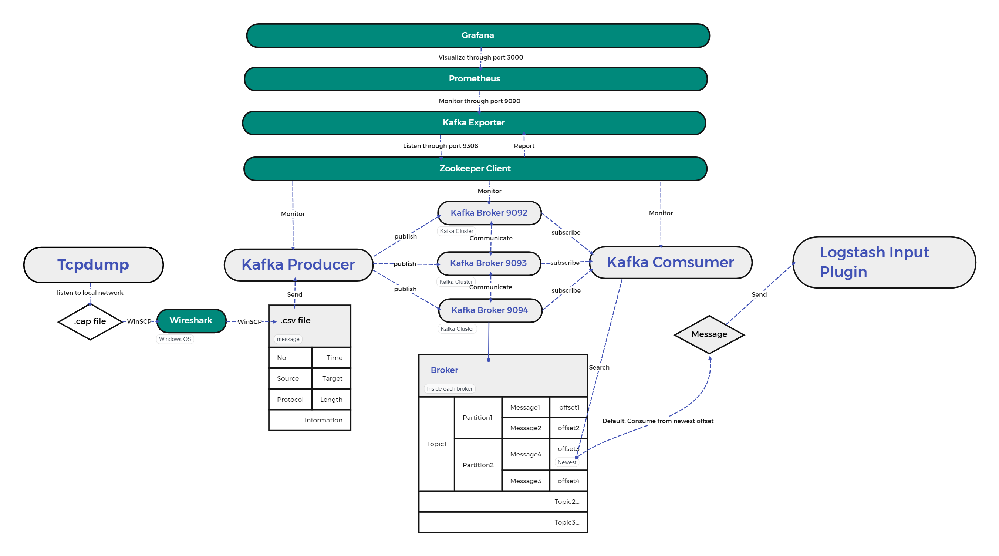

# Welcome, get to know my final project through this file.
From technical perspective, the purpose of this project is to build a system that integrates Tcpdump, Kafka subscription system and ELK (Logstash, Elasticsearch and Kibana). The system is able to capture network data traffic flow that go through local internet, to transform the captured data to analysable format at local, to transmit the captured data to Kafka brokers from local, to subscribe information from Kafka subscription system by Logstash, to store subscribed information to Elasticsearch and to use Kibana to monitor and visualize the data stored in Elasticsearch.

## Project Documentation

Download the final report associated to this project [here](./documentation/Guo_Mudong_2018213067_FinalReport.pdf).

## Project Architecture

## 1. Environment Configuration

Step 1. Prepare yourself a CentOS Environment
1. Download RPMs packet in https://www.centos.org/download/
2. Deploy it in VMware Workstation

Step 2. Download and deploy JDK 
1. Run command 'yum install java-1.8.0-openjdk' in command line
2. Run command 'java -version' to check version 
3. Configure JAVA_HOME env variable
4. Run command 'echo $JAVA_HOME' for validation

## 2. Data packet capturing
Step 1. Download Tcpdump in Linux
1. Download Tcpdump with command 'yum install tcpdump'
2. Run command 'tcpdump -i #your_own_network_port# -w #save_path#' in command line to capture data packets
3. Check data file in virtual machine which should be in the path #save_path# you defined

or if you want to deploy the data capture system in Windows OS, follow steps below:
1. Download Wireshark from https://www.wireshark.org/#download
2. Install wireshark on your computer following the official instruction
3. After after capturing data packets, use 'file --> Export Packet Dissections --> As CSV' to save the captured data packets to a CSV format file.

Step 2. Analyze data file in Windows with Wireshark
1. Transfer data file from virtual machine to local Windows OS with help of WinSCP
2. Download Wireshark in Windows from https://www.wireshark.org/#download (and if your are using Windows OS for data capturing, just follow steps above about usage of Wireshark)
3. Open data file in Wireshark for better visualization, export the file to CSV file with tools provided by Wireshark
4. Transfer the CSV file back to virtual machine for further analysis

## 3. Build up your own Kafka subscription system
Step 1. Download Zookeeper
1. Download Zookeeper from https://zookeeper.apache.org/releases.html#download
2. Go to the right directory where the installation package is in and deploy Zookeeper to local with the command 'tar -zxvf #name_of_zkpackage#'. For me, I deploy Zookeeper in '/opt'.
3. Go to 'conf' directory of Zookeeper, use the command 'mv zoo_sample.cfg zoo.cfg' and open it with the command 'vim zoo.cfg'. You may then notice a variable named dataDir, modify it to 'dataDir/opt/module/apache-zookeeper-3.x.x/zkData'. This is because the default directory is under '/temp' which will be cleared periodically since it is the temporary directory for Linux system. The clientPort variable is set to 2181 which means client could connect to Zookeeper through port 2181, we just keep it unchanged. 
4. To start Zookeeper server, use the command 'bin/zkServer.sh start' or just use 'zkServer.sh start' if you are under '/bin'
5. Use the command 'jps' to check the process status
6. Use the command 'bin/zkServer.sh status' to check status of Zookeeper server
7. To start Zookeeper Client, use the command 'bin/zkCli.sh', this is where you are able to monitor entity that relys on Zookeeper
8. To stop Zookeeper server, use the command 'bin/zkServer.sh stop'
9. Read document of Zookeeper from https://zookeeper.apache.org/doc/r3.7.0/index.html for better usage if you like

Step 2. Download Kafka
you should notice that each time you want to start Kafka cluster, you need to start Zookeeper server first
1. Download Kafka from https://www.apache.org/dyn/closer.cgi?path=/kafka/3.1.0/kafka_2.13-3.1.0.tgz
2. Go to the right directory where the installation package is in and use the command 'tar -zxvf' to deploy Kafka in your machine. 
3. Go the the config directory, you will find a file named server.properties; 
    use 'vim server.properties' to open it, you shall see a variable named broker.id=0, which the unique id for each kafka brokers in a cluster. 
    You shall see a variable defined like 'listeners=PLAINTEXT://:9092', change it to 'listeners=PLAINTEXT://#your ip address#:9092'
    You shall see a variable defined like 'advertised.listeners=PLAINTEXT://:9092', change it to 'advertised.listeners=PLAINTEXT://#your ip address#:9092'
    You shall see a variable named log.dirs, this is where data received by a broker be stored. you are recommended to change it to elsewhere instead of '/tmp'
    You should notice a variable defined like 'zookeeper.connect=localhost:2181', this is how it relys on Zookeeper server, just keep it remained
4. If you want to deploy a kafka cluster, at least 3 brokers are required. To do that, create another 2 configuration file in config directory and name them as     'server1.properties' and 'server2.properties'. Difference between them and initial 'server.properties' file is the broker.id and the port number; you are recommended to change it to 1&9093 and 2&9094.
5. To start a kafka broker, go to the '/bin' directory and use the command './kafka-server-start.sh -daemon ../config/server.properties'. Do this three times with right configuration filename for each brokers, then you could use 'jps' to check whether the kafka cluster has been started successfully
6. To monitor kafka cluster on terminal, go to '/opt/zookeeper/bin' and use the command './zkServer.sh start' and './zkCli.sh' one by one. You shall go to Zookeeper client successfully, then use the command 'ls /brokers/ids' within zkCli, if kafka cluster has been started successfully, you will see [0, 1, 2] printed in zkCli.
7. Read document of Kafka from https://kafka.apache.org/documentation/ for better comprehension
8. If you want to create new topics, use the command './kafka-topics --bootstrap-server ipadd:9092 ipadd:9093 ipadd:9094 --create --topic #name# --replication-factor #replicas nums# --partitions #partition nums#'. You shall see '#name# created' printed in command line, which means you have created a new topic

## 4. Deploy Logstash
Logstash will subscribe from Kafka brokers
Step 1. Download and deploy Logstash
1. Use the command 'wget https://artifacts.elastic.co/downloads/logstash/logstash-8.1.2-linux-x86_64.tar.gz' to download it to '/opt'
2. Use the command 'tar -zxvf logstash-8.1.2-linux-x86_64.tar.gz' to deploy it on your machine
3. Go to config directory of Lostash, you shall see a file named 'logstash-sample.conf', this is a sample of a Logstash tune, and you shall create your own Logstash tunes with the right format. 
4. If you want to start a Logstash tune, go to the path '/opt/logstash/bin' and run the command './logstash -f ../config/logstash-sample.conf'
5. You could use the conf file uploaded in this project or use your own configuration file. 

## 5. Deploy es
Step 1. Download and deploy es
1. use the command 'wget https://artifacts.elastic.co/downloads/elasticsearch/elasticsearch-8.1.2-linux-x86_64.tar.gz' to downlaod and deploy it.
2. If you want to start elasticsearch, you need to switch to another user except root. 
3. Use the command 'useradd es' to create a user named es
4. Use the command 'passwd es' to assign password to this new created user.
5. Start elasticsearch by user es, using the command 'bin/elasticsearch' to start
